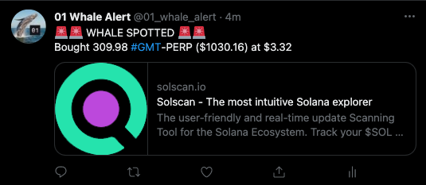

# 01 Exchange Whale Alert Bot

Polls for market orders greater than some threshold then tweets about them at https://twitter.com/01_whale_alert



## Setup

1. Install
```
yarn install
```

2. Add bunyan if necessary
```
npm i -g bunyan
```

3. Create `src/private.ts` with a SOL private key (can be empty) and Twitter API keys (requires **Elevated** access)
```
export const PRIVATE_KEY = ''

export const TWITTER_API_KEY = ''
export const TWITTER_API_SECRET = ''

export const TWITTER_ACCESS = ""
export const TWITTER_ACCESS_SECRET = ""
```

4. Edit `src/config.ts`
```
export const WHALE_THRESHOLD = 100000; // in usdc
export const SLEEP_DURATION = 2000; // in ms
export const RPC_ENDPOINT = 'https://ssc-dao.genesysgo.net';
export const CLUSTER = Cluster.Mainnet;
```

5. Run the bot
```
yarn start
```

## Testing

Change the `shouldTweet` boolean in `src/whaleBot.ts` to test without tweeting anything.

Change what the bot tweets by editing `private async tweet(...)` in `src/whaleBot.ts`. The function has both the whale's user key and the 01 control account key available, but I'm currently only tweeting out the whale user key.

## Notes

Getting Elevated Twitter access was instant for me so I did that to simplify Twitter integration, but it's possible to do it on Essential access.

On my machine, each loop iteration takes roughly 3-4s with a 2s sleep interval, so it should be processing every fill with no problems.

One optimization might be to check on the first iteration whether the fills in the event queue actually took place before the bot started and just happened to stick around. The possible failure case here is if the whale bot happens to process those fills, then fail and restart, then process and tweet again for those fills. But the Twitter API I'm using disallows duplicate recent tweets, so that case hasn't been a problem for me.
